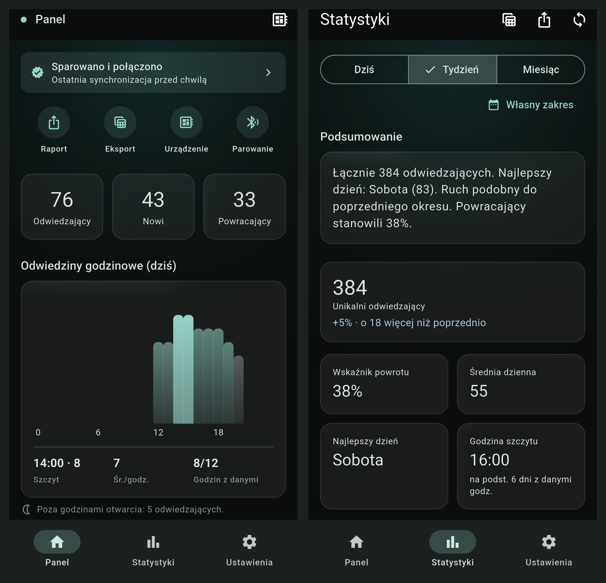

# PrintBack

> **Status:** this README describes the target architecture being built on
> `refactor/ble-sd-flutter` (BLE + SD + Flutter). The `main` branch is
> today's shipped system (USB-CDC → desktop dashboard, described below where
> still accurate). See [docs/PROGRESS.md](docs/PROGRESS.md) for what's
> actually built on this branch so far, and
> [docs/ARCHITECTURE.md](docs/ARCHITECTURE.md) /
> [docs/DATA_MODEL.md](docs/DATA_MODEL.md) for full detail.

Retail footfall analytics that runs entirely on the operator's own hardware.
A tiny ESP32-C6 sniffs WiFi probe requests near the entrance, hashes them
into pseudonymous device fingerprints on the chip, stores raw observations
on its own SD card (30-day retention), and aggregates them into hourly/daily
counts on-device. Only those aggregates — never a raw fingerprint, never a
MAC — are served over BLE to a companion Flutter app showing live traffic,
returning vs. new visitor split, and frequency segmentation.

No cloud, no network calls, no third-party services. Nothing but aggregated
counts ever leaves the device.



## What it does

- **Counts unique devices** with a rolling active-now window plus daily totals.
- **Splits new vs. returning visitors** using a lookback over stable
  IE-based fingerprints (configurable) — exact returning-window definition:
  see [docs/DATA_MODEL.md](docs/DATA_MODEL.md) "Otwarte pytania".
- **Whitelists sustained presence** — staff phones, the router, the
  neighbouring shop's WiFi — via a physical button on the device (hold to
  capture). There is no automatic hours-per-window detection today; if that
  gets built it'll be a named, tracked phase, not something silently assumed.
- **Layered retention** with automatic purge: 30 days raw observations on
  the device SD card, unlimited-retention identifier-free aggregates (they
  aren't personal data — see [docs/DECISIONS.md](docs/DECISIONS.md) D3).
- **k-anonymity enforced on-device**: hourly aggregates below a 5-event
  threshold are folded into the daily total instead of being published
  hourly.
- **Bilingual UI** — Polish / English (current desktop app; mobile app
  carries this forward in Phase 6).

## Repository layout

- `firmware/` — ESP-IDF C firmware for the XIAO ESP32-C6 board. Promiscuous
  WiFi sniffer, IE hashing on-chip (host never sees raw bytes), tact-switch
  plus RGB LED for whitelist capture, Task / Interrupt / Brownout watchdogs
  for unattended stability. Target architecture adds on-device SD storage,
  hourly/daily aggregation, and a BLE GATT server — see
  [docs/ARCHITECTURE.md](docs/ARCHITECTURE.md).
- `app/` — Python desktop app (PySide6 + pyqtgraph + stdlib sqlite3 +
  pyserial). Live and historical dashboard, hourly chart, 7-day comparison,
  visit-frequency segmentation. Includes a supervisor wrapper and software
  USB reset (Windows `pnputil`) for unattended deployment. To be phased out
  once the BLE/mobile path is complete — no phase currently schedules its
  removal, see [docs/PROGRESS.md](docs/PROGRESS.md).
- `mobile/` — Flutter companion app (Android + iOS), BLE central, caches
  aggregates only. Not built yet — Phase 6, see
  [docs/TASKS.md](docs/TASKS.md).
- `docs/compliance/` — plain-language technical brief describing the data
  architecture, retention design, and the privacy choices that are
  architecturally enforced (no crosslinking, no network calls, no raw
  export). Intended as a starting point for a lawyer drafting downstream
  RODO / GDPR documents per deployment. Describes today's USB/desktop
  system; update scheduled for Phase 7.

## Quick start

### Firmware

Requires ESP-IDF 5.3+ and a XIAO ESP32-C6.

```sh
cd firmware
idf.py set-target esp32c6
idf.py build
idf.py -p <COMx> flash monitor
```

Target architecture: the device's headline output is an aggregate served
over BLE (see [docs/DATA_MODEL.md](docs/DATA_MODEL.md)), not a per-probe
line:

```json
{"date":"2026-07-02","hour":14,"unique":37,"returning":22,"kanon":false}
```

A per-probe USB-CDC debug line still exists today for bench debugging
(115200 baud) — the `"mac"` field it currently includes is scheduled for
removal in Phase 3, since raw MAC must never appear anywhere outside the
device's own SD card, including today's USB debug output:

```json
{"t":12345678,"fp":"cba68c5d230c5649","mac":"a4c1380c2e3f","rssi":-67,"ch":6,"ies":11,"new":true,"wl":false}
```

### App (current, main branch)

Requires Python 3.11+.

```sh
cd app
python -m venv .venv
.venv\Scripts\activate                  # Windows
pip install -e .
printback                               # auto-detects ESP via VID; --port COMx to override
```

For unattended deployment use `app/scripts/run-as-admin.bat` — wraps the app
in a supervisor that restarts it on crashes and can issue a software USB
reset when the Windows driver gets stuck without unplugging the cable.

Data and config live under `%APPDATA%\PrintBack\` on Windows
(`~/.local/share/PrintBack/` on Linux).

### Mobile app (target, this branch)

Not built yet — Phase 6, see [docs/TASKS.md](docs/TASKS.md). Will live in
`mobile/`, Flutter (`flutter_blue_plus`), pairs with the device over BLE and
caches aggregates only.

## Honest limits

WiFi probe sniffing is a useful proxy for footfall but not a precise
measurement. Modern phones randomize their MAC and some randomize WiFi
capabilities between probe bursts, so the same real visitor can appear as
2-3 different fingerprints. Treat the numbers as trend estimation with a
~10-30% error margin — "traffic up 15% this week", not "exactly 142
customers".

## License

PolyForm Noncommercial 1.0.0 — see [LICENSE](LICENSE). Free for personal,
research and educational use. Commercial use requires a separate license.
